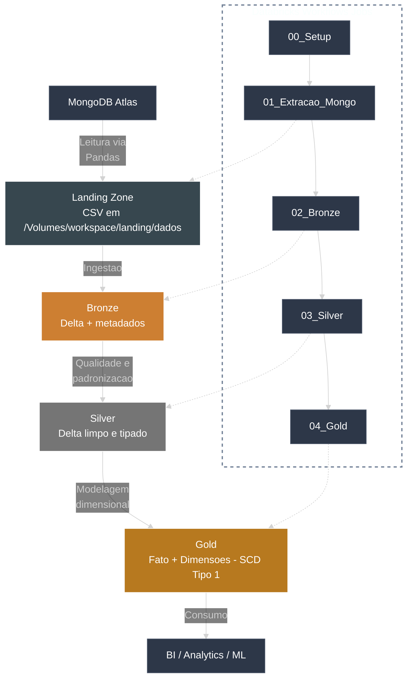

# 🏗 Arquitetura Medalhão

Esta arquitetura organiza os dados em camadas para **garantir qualidade, governanca e performance**. O pipeline e orquestrado pelo Databricks Jobs, executando notebooks em sequencia e promovendo os dados da Landing ate o consumo analitico.

---

## 🎯 Entradas e saidas

**Entradas**

- Fonte operacional: **MongoDB Atlas**
- Entidades: **clientes, carros, apolices, sinistros, enderecos**
- Extracao via Pandas e salvamento em **CSV na Landing Zone**

**Saidas**

- Tabelas **Delta** em Bronze, Silver e Gold
- **Gold** preparado para consumo por BI, analytics e ML

---

## 🔁 Fluxo detalhado

1. **Setup** cria schemas e volumes
2. **Extracao** conecta no Mongo, remove `_id` e grava CSVs na Landing
3. **Bronze** adiciona metadados tecnicos e salva em Delta
4. **Silver** faz limpeza, tipagem e tratamento de nulos
5. **Gold** aplica modelagem dimensional com SCD Tipo 1 (upsert)

---

## 🧭 Diagrama avancado da arquitetura

---

## 🧱 Camadas e responsabilidades

### 🥉 Bronze

- Ingestao fiel ao dado bruto
- Metadados tecnicos adicionados
- Historico completo preservado

### 🥈 Silver

- Limpeza e padronizacao
- Tipagem de dados e regras de negocio
- Tratamento de nulos e duplicidades

### 🥇 Gold

- Modelo dimensional (fato e dimensoes)
- Upsert com SCD Tipo 1
- Dados prontos para consumo analitico