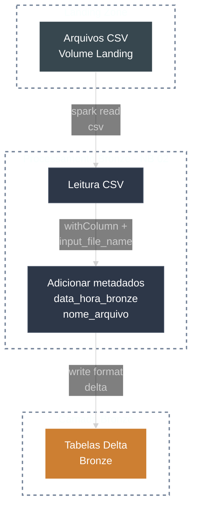

# 🥉 Bronze Layer

A camada Bronze captura o dado **bruto** da Landing Zone e adiciona metadados tecnicos para rastreabilidade, mantendo historico completo.

---

## 🎯 Objetivos

- Preservar dados originais
- Garantir rastreabilidade
- Permitir reprocessamento

---

## 🔁 Fluxo



---

## ✅ Regras principais

- Leitura dos CSVs da Landing
- Adicao de metadados: `data_hora_bronze`, `nome_arquivo`
- Persistencia em **Delta** sem transformacoes de negocio

### 💻 Exemplo de Código (PySpark)

```python
from pyspark.sql.functions import current_timestamp, input_file_name

landing_path = "/Volumes/workspace/landing/dados/clientes/*.csv"

df = (
    spark.read.option("header", True).csv(landing_path)
    .withColumn("data_hora_bronze", current_timestamp())
    .withColumn("nome_arquivo", input_file_name())
)

(
    df.write.format("delta")
    .mode("append")
    .saveAsTable("bronze.clientes")
)
```

---

## 🧩 Exemplo simplificado de schema

```text
cliente_id (string)
nome (string)
cpf (string)
data_nascimento (string)
data_hora_bronze (timestamp)
nome_arquivo (string)
```