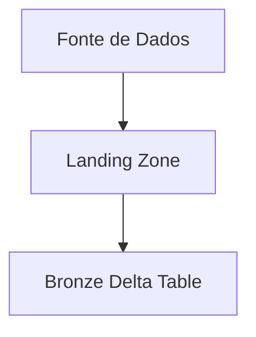

# 🥉 Bronze Layer

A camada Bronze é responsável pela ingestão dos dados brutos.

## Objetivos

- Preservar dados originais
- Garantir rastreabilidade
- Permitir reprocessamento

---

## Fluxo

---

## Características

- Dados sem transformação
- Estrutura original mantida
- Particionamento inicial