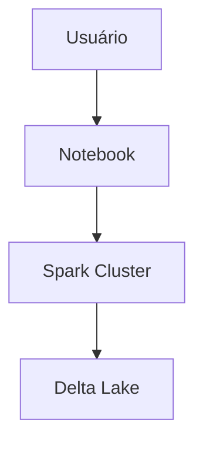

# ⚡ Databricks

O Databricks foi utilizado como plataforma principal de processamento.

---

## Funcionalidades Utilizadas

- Apache Spark
- Delta Lake
- Notebooks
- Jobs
- Cluster Computing

---

## Benefícios

- Processamento distribuído
- Alta performance
- Integração com Delta Lake

---

## Arquitetura

