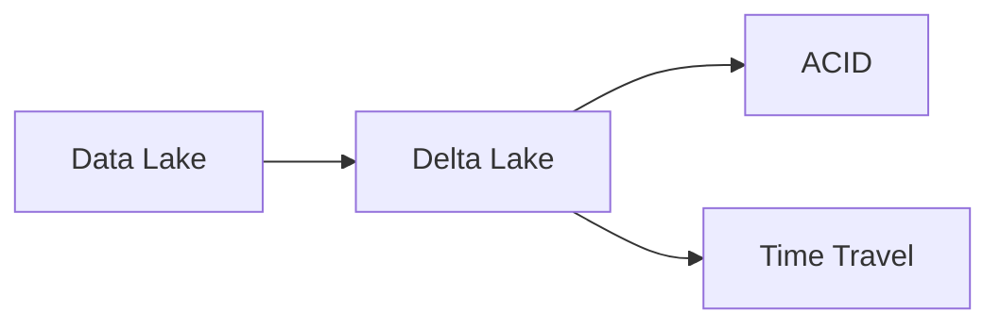

# 🧊 Delta Lake

O Delta Lake adiciona confiabilidade e transações ACID ao Data Lake.

---

## Funcionalidades

- ACID Transactions
- Time Travel
- Schema Enforcement
- Schema Evolution

---

## Fluxo

---

## Benefícios

| Funcionalidade | Benefício |
|---|---|
| ACID | Confiabilidade |
| Time Travel | Versionamento |
| Schema Enforcement | Qualidade |