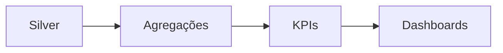

# 🥇 Gold Layer

Camada analítica final para consumo.

## Objetivos

- Criar métricas
- Gerar KPIs
- Disponibilizar dashboards

---

## Fluxo Analítico

---

## Casos de Uso

- Power BI
- Analytics
- Machine Learning