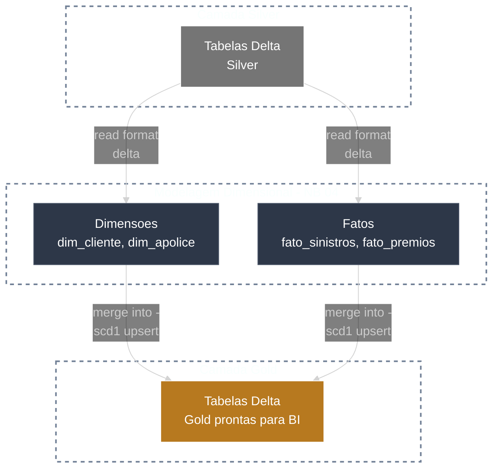

# 🥇 Gold Layer

A camada Gold entrega o **modelo dimensional** para consumo, com Fato e Dimensoes geradas via **MERGE INTO (SCD Tipo 1)**.

---

## 🎯 Objetivos

- Criar metricas confiaveis
- Gerar KPIs
- Disponibilizar dados para BI e analytics

---

## 🔁 Fluxo analitico



---

## ✅ Regras principais

- Modelagem dimensional (Fato e Dimensoes)
- SCD Tipo 1 com **MERGE INTO** (upsert)
- Chaves substitutas quando necessario

### 💻 Exemplo de Código (PySpark)

```python
spark.sql(
        """
        MERGE INTO gold.dim_cliente AS tgt
        USING silver.clientes AS src
        ON tgt.cliente_id = src.cliente_id
        WHEN MATCHED THEN UPDATE SET
            tgt.nome = src.nome,
            tgt.cpf = src.cpf,
            tgt.data_nascimento = src.data_nascimento
        WHEN NOT MATCHED THEN INSERT (cliente_id, nome, cpf, data_nascimento)
        VALUES (src.cliente_id, src.nome, src.cpf, src.data_nascimento)
        """
)
```

---

## 🧩 Exemplo simplificado de schema

```text
fato_sinistros
    - sinistro_id (string)
    - cliente_sk (int)
    - apolice_sk (int)
    - data_sinistro (date)
    - valor_sinistro (decimal)

dim_cliente
    - cliente_sk (int)
    - cliente_id (string)
    - nome (string)
    - cpf (string)
```