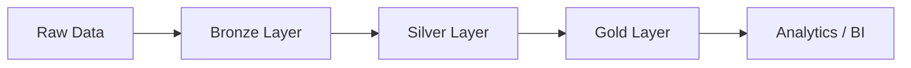
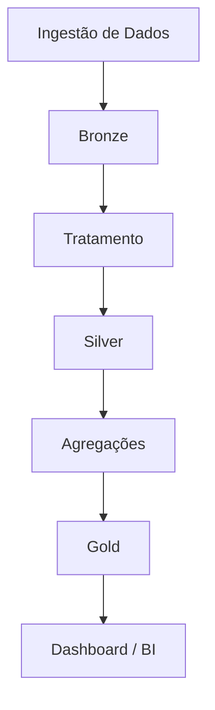

# 🚀 Lakehouse Medalhão com Databricks

## 📖 Sobre o Projeto

Este projeto implementa uma arquitetura **Lakehouse Medalhão** utilizando:

- Apache Spark
- Delta Lake
- Databricks
- PySpark

O pipeline segue o padrão moderno de engenharia de dados dividido em:

- 🥉 Bronze Layer
- 🥈 Silver Layer
- 🥇 Gold Layer

---

## 🏗 Arquitetura Geral



---

## 🎯 Objetivos

- Criar pipeline escalável
- Garantir qualidade dos dados
- Aplicar arquitetura moderna
- Implementar boas práticas de engenharia de dados

---

## ⚙️ Tecnologias Utilizadas

| Tecnologia | Finalidade |
|---|---|
| Databricks | Processamento distribuído |
| Apache Spark | ETL |
| Delta Lake | Armazenamento transacional |
| Python | Desenvolvimento |
| MkDocs | Documentação |

---

## 📂 Estrutura do Projeto

```bash
.
├── bronze/
├── silver/
├── gold/
├── notebooks/
├── docs/
└── mkdocs.yml
```

---

## 📊 Pipeline de Dados

