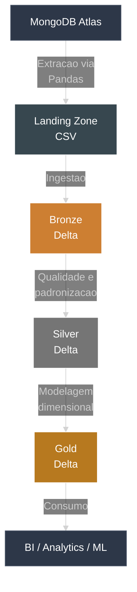

# 🚀 Lakehouse Medalhão (Databricks)

## 📌 Problema e objetivo de negócio

A seguradora precisa unificar dados de **clientes, carros, apólices, sinistros e endereços** para acelerar análises, melhorar a qualidade dos relatórios e reduzir retrabalho entre times. Este projeto entrega um **Lakehouse completo** com Arquitetura Medallion na plataforma Databricks, garantindo rastreabilidade, governança e performance ao longo do ciclo de vida dos dados.

Objetivos principais:

- Unificar dados operacionais em uma visão confiável
- Garantir qualidade com camadas de tratamento
- Acelerar o consumo por BI e analytics
- Padronizar processos com orquestração automatizada

---

## 🧭 Fluxo ponta a ponta

1. **Extração (MongoDB Atlas)** com proteção de credenciais via `dbutils.widgets`
2. **Landing Zone (CSV)** em `/Volumes/workspace/landing/dados`
3. **Bronze (Delta)** com metadados técnicos
4. **Silver (Delta)** com limpeza, tipagem e padronização
5. **Gold (Delta)** com modelo dimensional e SCD Tipo 1

---

## 🏗 Arquitetura geral

---

## ✅ O que esta documentado

- **Arquitetura** e fluxo do Lakehouse
- **Camadas Bronze, Silver e Gold** com regras aplicadas
- **Orquestracao do pipeline** no Databricks Jobs
- **Tecnologias** utilizadas e seus beneficios

---

## ⚙️ Tecnologias utilizadas

| Tecnologia | Finalidade |
|---|---|
| Databricks | Processamento distribuido e orquestracao |
| Apache Spark | ETL escalavel |
| Delta Lake | Armazenamento transacional e ACID |
| MongoDB Atlas | Fonte operacional |
| Python / PySpark | Transformacoes e modelagem |
| MkDocs | Documentacao |