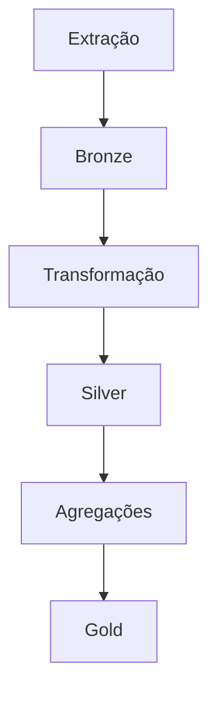

# 🔄 Pipeline ETL

O pipeline segue as etapas modernas de engenharia de dados.

---

## Fluxo Completo

---

## Etapas

### Extração
Coleta dos dados brutos.

### Transformação
Padronização e limpeza.

### Carga
Persistência em Delta Lake.

---

## Benefícios

- Escalabilidade
- Reprocessamento
- Confiabilidade