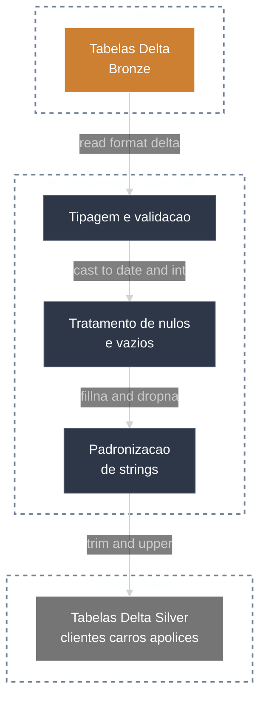

# 🥈 Silver Layer

A camada Silver aplica **limpeza, tipagem e padronizacao**, preparando os dados para consumo analitico com qualidade elevada.

---

## 🔧 Processamentos

- Tratamento de nulos
- Remocao de duplicados
- Conversao de tipos
- Padronizacao de campos

---

## 🔁 Pipeline



---

## ✅ Regras principais

- Tipagem correta de datas e numericos
- Padronizacao de textos (ex: upper/lower, trim)
- Remocao de registros duplicados
- Tratamento de nulos conforme regra de negocio

### 💻 Exemplo de Código (PySpark)

```python
from pyspark.sql.functions import col, trim, upper
from pyspark.sql.types import DateType, IntegerType

df = spark.read.format("delta").table("bronze.clientes")

df = df.fillna({"nome": "NA", "cpf": "NA"})
df = df.withColumn("data_nascimento", col("data_nascimento").cast(DateType()))
df = df.withColumn("idade", col("idade").cast(IntegerType()))
df = df.withColumn("nome", upper(trim(col("nome"))))

(
    df.write.format("delta")
    .mode("overwrite")
    .saveAsTable("silver.clientes")
)
```

---

## 🧩 Exemplo simplificado de schema

```text
cliente_id (string)
nome (string)
cpf (string)
data_nascimento (date)
idade (int)
```