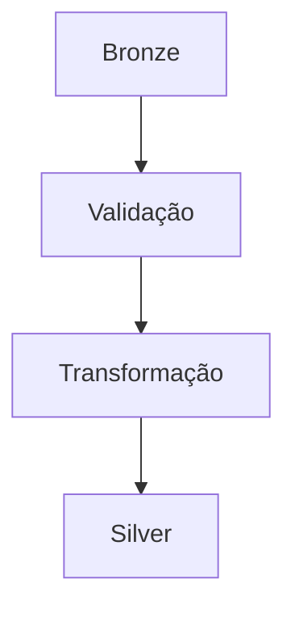

# 🥈 Silver Layer

A camada Silver realiza limpeza e padronização.

## Processamentos

- Tratamento de nulos
- Remoção de duplicados
- Conversão de tipos
- Padronização

---

## Pipeline

---

## Benefícios

- Melhor qualidade dos dados
- Consistência
- Dados confiáveis